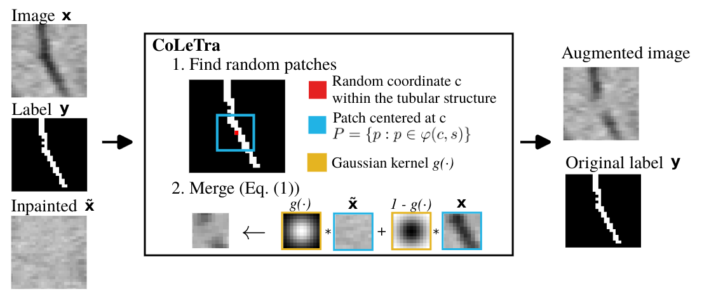

# Readme

Repository of the paper **Disconnect to Connect: A Data Augmentation Method for Improving Topology Accuracy in Image Segmentation**



### Table of Contents
* [1. CoLeTra](#1-coletra)
* [2. Reproducibility](#2-reproducibility)
* [2.1. Virtual environment and dependencies](#21-virtual-environment-and-dependencies)
* [2.2. Training code](#22-training-code)
* [2.3. Evaluation code](#23-evaluation-code)

## 1. CoLeTra

CoLeTra is a data augmentation transformation to enhance topology accuracy in image segmentation. You can find its implementation [here](lib/transforms.py).

## 2. Reproducibility
## 2.1. Virtual environment and dependencies

```
# Create a virtual environment
python -m venv /PATH/
source /PATH/bin/activate

# Install requirements, pytorch, and MONAI
pip install -r requirements.txt
pip install torch==1.13.1+cu117 torchvision==0.14.1+cu117 torchaudio==0.13.1 --extra-index-url https://download.pytorch.org/whl/cu117
pip install monai==1.3.0
```

## 2.2. Training code
This framework trains models according to a configuration file, which facilitates conducting experiments. These configuration files provide with all the necessary information, including models, dataset, loss function, data augmentation transformations, etc.

You can train a model in the following way:

```
python train.py --config config/exps/<dataset>-<architecture>-<loss>.yaml

# Example
python train.py --config config/exps/drive-dynunet-dice.yaml
```

* dataset: "drive", "crack500", "cremi", "narwhal"
* architecture: "dynunet", "attentionunet"
* loss: "ce", "dice", "rwloss", "cldice", "warploss", "topoloss"

## 2.3. Evaluation code
Similarly to the training code, you can run:

```
# Generating the predictions in the test set
python pred.py --config config/exps/<dataset>-<architecture>-<loss>.yaml

# Measuring the metrics between the predictions and the ground truth
python pred.py --config config/exps/<dataset>-<architecture>-<loss>.yaml
```
